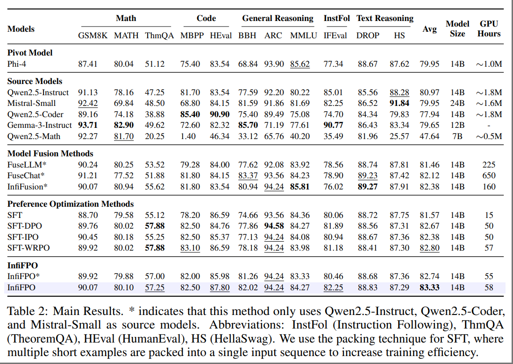

<h2 align="center">
InfiFPO: Implicit Model Fusion via Preference Optimization in Large Language Models
</h2>
<!-- <h5 align="center"> If you like our project, please give us a star ⭐ on GitHub for the latest update.</h5> -->
<!-- <h5 align=center>
</h5> -->

## 📣 News
* **[2025/05/17]**  🚀 Source code released! We're now working on extending InfiFPO to more LLMs.

## 🎯 Overview
We propose **InfiFPO**, a principled and efficient framework for performing model fusion during the preference alignment phase. Our key insight is that the reference model in preference optimization (e.g., in DPO) can be replaced with a fused source model, thereby enabling the pivot model to learn not only from preference data but also from the probabilistic behaviors of multiple source models.



Comprehensive experiments on 11 widely-used benchmarks demonstrate that **InfiFPO** consistently outperforms existing model fusion and preference optimization methods. When using Phi-4 as the pivot model, **InfiFPO** improve its average performance from 79.95 to 83.33 on 11 benchmarks, significantly improving its capabilities in mathematics, coding, and reasoning tasks.

## 🕹️ Usage

### Installation

```
git clone https://github.com/Reallm-Labs/InfiFPO.git
cd InfiFPO
conda create -n infifpo python==3.10
conda activate infifpo
pip install -r requirements.txt
```

### Training

Our training code is primarily based on the `dpo_trainer` from the [TRL library](https://github.com/huggingface/trl) by Hugging Face. Specifically, we reference the implementation in [dpo_trainer.py](https://github.com/huggingface/trl/blob/main/trl/trainer/dpo_trainer.py).

- Check the `run.sh` file
- If you're using a SLURM cluster, check the `run-slurm.sh` file instead


## Supported Dataset Format

InfiFPO now supports datasets with the following structure and fields:

- **`chosen`**: The preferred response
- **`rejected`**: The non-preferred response

### Pre-calculated Log Probabilities

#### Pivot Model Metrics
- **`ref_chosen_logps`**: Log probabilities of the `chosen` response calculated by the pivot model
- **`ref_rejected_logps`**: Log probabilities of the `rejected` response calculated by the pivot model
- **`ref_mean_chosen_logps`**: Mean log probabilities of the `chosen` response calculated by the pivot model
- **`ref_mean_rejected_logps`**: Mean log probabilities of the `rejected` response calculated by the pivot model

#### Source Model Metrics
- **`fuse_chosen_logps`**: Log probabilities of the `chosen` response calculated by the source model
- **`fuse_rejected_logps`**: Log probabilities of the `rejected` response calculated by the source model
- **`fuse_mean_chosen_logps`**: Mean log probabilities of the `chosen` response calculated by the source model
- **`fuse_mean_rejected_logps`**: Mean log probabilities of the `rejected` response calculated by the source model


### Example
```
    {
        "chosen": [
            {
                "role": "user",
                "content": "A batch of barley seeds had the following germination test results under the same conditions:\n\n| Number of Seeds | $50$ | $100$ | $300$ | $400$ | $600$ | $1000$ |\n|-----------------|------|-------|-------|-------|-------|--------|\n| Germination Frequency | $47$ | $96$ | $284$ | $380$ | $571$ | $948$ |\n\nEstimate the probability of germination for this batch of barley seeds. (Round the result to $0.01$)"
            },
            {
                "role": "assistant",
                "content": "To estimate the probability of germination for the batch of barley seeds, we need to calculate the overall germination rate across all the samples. This involves finding the total number of seeds that germinated and dividing it by the total number of seeds tested.\n\nFirst, we calculate the total number of seeds:\n\n\\[\n50 + 100 + 300 + 400 + 600 + 1000 = 2450\n\\]\n\nNext, we calculate the total number of seeds that germinated:\n\n\\[\n47 + 96 + 284 + 380 + 571 + 948 = 2326\n\\]\n\nNow, we find the probability of germination by dividing the total number of germinated seeds by the total number of seeds:\n\n\\[\n\\text{Probability of germination} = \\frac{2326}{2450}\n\\]\n\nPerform the division:\n\n\\[\n\\frac{2326}{2450} \\approx 0.9493877551\n\\]\n\nRounding this to two decimal places gives:\n\n\\[\n0.95\n\\]\n\nThus, the estimated probability of germination for this batch of barley seeds is \\(\\boxed{0.95}\\)."
            }
        ],
        "rejected": [
            {
                "role": "user",
                "content": "A batch of barley seeds had the following germination test results under the same conditions:\n\n| Number of Seeds | $50$ | $100$ | $300$ | $400$ | $600$ | $1000$ |\n|-----------------|------|-------|-------|-------|-------|--------|\n| Germination Frequency | $47$ | $96$ | $284$ | $380$ | $571$ | $948$ |\n\nEstimate the probability of germination for this batch of barley seeds. (Round the result to $0.01$)"
            },
            {
                "role": "assistant",
                "content": "To estimate the probability of germination for the batch of barley seeds, we need to calculate the overall germination rate based on the given data. The germination rate is the ratio of the total number of seeds that germinated to the total number of seeds tested.\n\nFirst, let's calculate the total number of seeds tested:\n\n\\[\n50 + 100 + 300 + 400 + 600 + 1000 = 2450\n\\]\n\nNext, let's calculate the total number of seeds that germinated:\n\n\\[\n47 + 96 + 284 + 380 + 571 + 948 = 2326\n\\]\n\nNow, we can calculate the probability of germination by dividing the total number of seeds that germinated by the total number of seeds tested:\n\n\\[\n\\text{Probability of germination} = \\frac{2326}{2450}\n\\]\n\nPerform the division:\n\n\\[\n\\frac{2326}{2450} \\approx 0.9481632653\n\\]\n\nRounding this result to two decimal places gives:\n\n\\[\n0.95\n\\]\n\nTherefore, the estimated probability of germination for this batch of barley seeds is \\( \\boxed{0.95} \\)."
            }
        ],
        "ref_chosen_logps": -16.809629440307617,
        "ref_mean_chosen_logps": -0.06974949687719345,
        "ref_rejected_logps": -35.141197204589844,
        "ref_mean_rejected_logps": -0.13944919407367706,
        "fuse_chosen_logps": [
            -67.31946563720703,
            -74.1878662109375,
            -104.12448120117188
        ],
        "fuse_mean_chosen_logps": [
            -0.2378779649734497,
            -0.2621479332447052,
            -0.3679310381412506
        ],
        "fuse_rejected_logps": [
            -75.14492797851562,
            -78.72958374023438,
            -99.033447265625
        ],
        "fuse_mean_rejected_logps": [
            -0.25559499859809875,
            -0.2677876949310303,
            -0.3368484675884247
        ]
```
