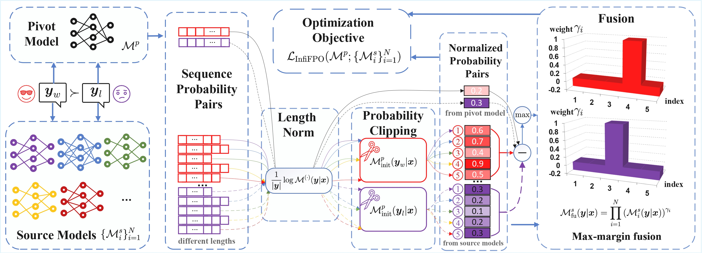

<div align="center">
  
</div>
<div align="center">

<!-- 快速链接区域 -->

<div align="center" style="margin: 20px 0; display: flex; justify-content: center; gap: 15px; flex-wrap: wrap;">
  <a href="https://arxiv.org/abs/2505.13878" style="padding: 8px 15px; background-color: #B22222; color: white; border-radius: 5px; text-decoration: none;">📚 Paper</a>
  <a href="https://github.com/InfiXAI/InfiFPO" style="padding: 8px 15px; background-color: #24292e; color: white; border-radius: 5px; text-decoration: none;">💻 Code</a>
  <a href="https://huggingface.co/InfiX-ai/InfiFPO-14B" style="padding: 8px 15px; background-color: #FFD700; color: black; border-radius: 5px; text-decoration: none;">🤗 Model</a>
</div>

# *InfiFPO*: Implicit Model Fusion via Preference Optimization in Large Language Models

**Yanggan Gu**¹², **Zhaoyi Yan**², **Yuanyi Wang**¹,**Yiming Zhang**¹, **Qi Zhou**¹, **Fei Wu**³, **Hongxia Yang**¹²

¹The Hong Kong Polytechnic University, ²InfiX.ai, ³Zhejiang University

</div>

> To appear at NeurIPS 2025 *Spotlight* !

---

## Abstract

Model fusion combines multiple Large Language Models (LLMs) with different strengths into a more powerful, integrated model through lightweight training methods. 

Existing works on model fusion focus primarily on supervised fine-tuning (SFT), leaving preference alignment (PA) --a critical phase for enhancing LLM performance--largely unexplored. The current few fusion methods on PA phase, like WRPO, simplify the process by utilizing only response outputs from source models while discarding their probability information. 

To address this limitation, we propose *InfiFPO*, a preference optimization method for implicit model fusion. *InfiFPO* replaces the reference model in Direct Preference Optimization (DPO) with a fused source model that synthesizes multi-source probabilities at the sequence level, circumventing complex vocabulary alignment challenges in previous works and meanwhile maintaining the probability information. By introducing probability clipping and max-margin fusion strategies, *InfiFPO* enables the pivot model to align with human preferences while effectively distilling knowledge from source models. 

Comprehensive experiments on 11 widely-used benchmarks demonstrate that *InfiFPO* consistently outperforms existing model fusion and preference optimization methods. When using Phi-4 as the pivot model, *InfiFPO* improve its average performance from **79.95 to 83.33** on **11 benchmarks**, significantly improving its capabilities in mathematics, coding, and reasoning tasks.

---

## *InfiFPO*: A Paradigm Shift in Model Fusion

Our solution, *InfiFPO*, introduces three key breakthroughs:



### **Ⅰ. Implicit Model Fusion**🎯

Instead of wrestling with complex vocabulary alignment at the token level, we operate at the **sequence level**, seamlessly integrating probabilities from multiple source models. This elegant approach preserves crucial probability information while avoiding compatibility headaches.

### **Ⅱ. Three Pillars of Stability** 🔧

- **Length Normalization**
  
  - Eliminates bias from varying tokenization patterns across models
  - Ensures fair comparison of sequence probabilities regardless of token length

- **Probability Clipping**
  
  - Prevents underperforming source models from introducing noise
  - Maintains training stability by setting intelligent probability boundaries

- **Max-Margin Fusion**
  
  - Automatically identifies the most informative source model for each scenario
  - Focuses on learning distinctive, complementary knowledge

### **Ⅲ. Efficient Training Pipeline** ⚡

By transforming the complex reinforcement learning problem into an efficient offline optimization objective, InfiFPO achieves remarkable results without the computational overhead of traditional methods.

---

## Impressive Results Across the Board

Our comprehensive evaluation across **11 diverse benchmarks** demonstrates *InfiFPO*'s consistent superiority:

| Capability Area | Before *InfiFPO* | After *InfiFPO* | Improvement |
| --------------- | ---------------- | --------------- | ----------- |
| **Mathematics** | 72.85            | 75.80           | **+2.95**   |
| **Coding**      | 79.47            | 85.15           | **+5.68**   |
| **Overall**     | 79.95            | 83.33           | **+3.38**   |

---

## Beyond the Numbers: Technical Foundation

*InfiFPO*'s beauty lies in its mathematical foundation. By replacing the reference model in Direct Preference Optimization with a carefully fused source model, we create an optimization objective that simultaneously:

- Aligns with human preferences
- Distills knowledge from multiple expert models
- Maintains training stability and efficiency

The extra gradient analysis reveals how *InfiFPO* weights training samples based on the divergence between source and pivot model preferences, focusing optimization efforts where they matter most.

---

## BibTeX

```bibtex
@misc{gu-2025-infifpo,
      title={InfiFPO: Implicit Model Fusion via Preference Optimization in Large Language Models}, 
      author={Yanggan Gu and Zhaoyi Yan and Yuanyi Wang and Yiming Zhang and Qi Zhou and Fei Wu and Hongxia Yang},
      year={2025},
      eprint={2505.13878},
      archivePrefix={arXiv},
      primaryClass={cs.LG},
      url={https://arxiv.org/abs/2505.13878}, 
}
```